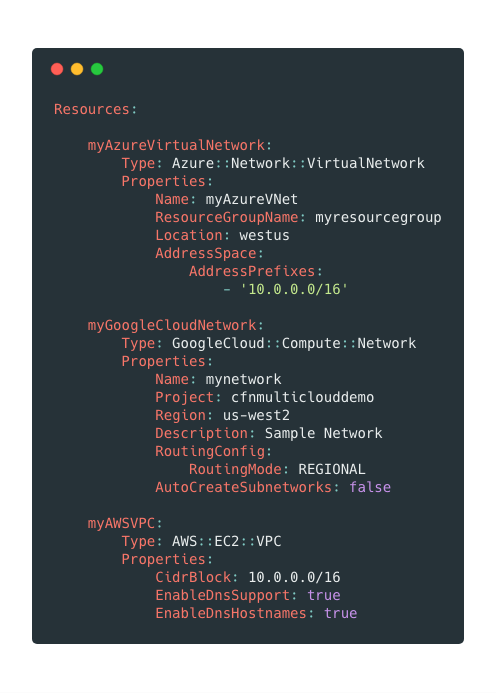

# CloudFormation Multi-Cloud

> An experiment to add Azure and Google Cloud resource support to CloudFormation.

:exclamation: **CAUTION:** This project is currently in alpha stages. Some components may not work as expected and fields may not be validated. Currently, all fields within the example stacks are required.

## Installation

Click the above link to deploy the stack which is required to deploy the Transform and Custom Resource handler. You will be asked to input your Azure app credentials and Google JSON server credentials.

If you prefer, you can also manually upsert the [custom_resource.yaml](https://github.com/iann0036/CloudFormationMultiCloud/blob/master/custom_resource.yaml) stack from source and compile your own copy of the Lambda source. Please note that if you do this, the Python requirements must be vendored from within an Amazon Linux machine.

## Usage

Once the handler stack is created, you may use the below resources by adding the `MultiCloud` transform to your stack. This will transform your input template to convert the Azure/Google Cloud resources into Custom Resources that will handle the lifecycle within that cloud provider.

The following resources are supported (click the link to see examples):

Functionality | AWS Resource | Azure Resource | Google Cloud Resource
------------- | ------------ | -------------- | ---------------------
Logical Group | - | [Azure::Resource::ResourceGroup](https://github.com/iann0036/CloudFormationMultiCloud/blob/master/examples/azure_bucket.yaml#L10-L14) | -
Virtual Network | AWS::EC2::VPC | [Azure::Network::VirtualNetwork](https://github.com/iann0036/CloudFormationMultiCloud/blob/master/examples/azure_example.yaml#L16-L24) | [GoogleCloud::Compute::Network](https://github.com/iann0036/CloudFormationMultiCloud/blob/master/examples/googlecloud_example.yaml#L10-L19)
Subnet | AWS::EC2::Subnet | [Azure::Network::Subnet](https://github.com/iann0036/CloudFormationMultiCloud/blob/master/examples/azure_example.yaml#L26-L32) | [GoogleCloud::Compute::Subnetwork](https://github.com/iann0036/CloudFormationMultiCloud/blob/master/examples/googlecloud_example.yaml#L21-L31)
Network Interface | AWS::EC2::NetworkInterface | [Azure::Network::NetworkInterface](https://github.com/iann0036/CloudFormationMultiCloud/blob/master/examples/azure_example.yaml#L34-L43) | -
Virtual Machine | AWS::EC2::Instance | [Azure::Compute::VirtualMachine](https://github.com/iann0036/CloudFormationMultiCloud/blob/master/examples/azure_example.yaml#L45-L65) | [GoogleCloud::Compute::Instance](https://github.com/iann0036/CloudFormationMultiCloud/blob/master/examples/googlecloud_example.yaml#L33-L59)
Queue | AWS::SQS:Queue | [Azure::Storage::Queue](https://github.com/iann0036/CloudFormationMultiCloud/blob/master/examples/azure_queue.yaml#L26-L31) | [GoogleCloud::PubSub::Topic](https://github.com/iann0036/CloudFormationMultiCloud/blob/master/examples/googlecloud_queue.yaml#L10-L14)
Object Bucket | AWS::S3::Bucket | [Azure::Storage::StorageAccount](https://github.com/iann0036/CloudFormationMultiCloud/blob/master/examples/azure_bucket.yaml#L16-L24) | [GoogleCloud::Storage::Bucket](https://github.com/iann0036/CloudFormationMultiCloud/blob/master/examples/googlecloud_bucket.yaml#L10-L18)
