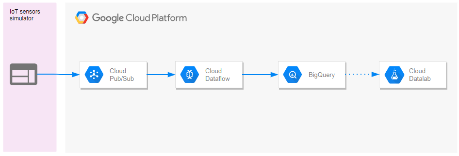
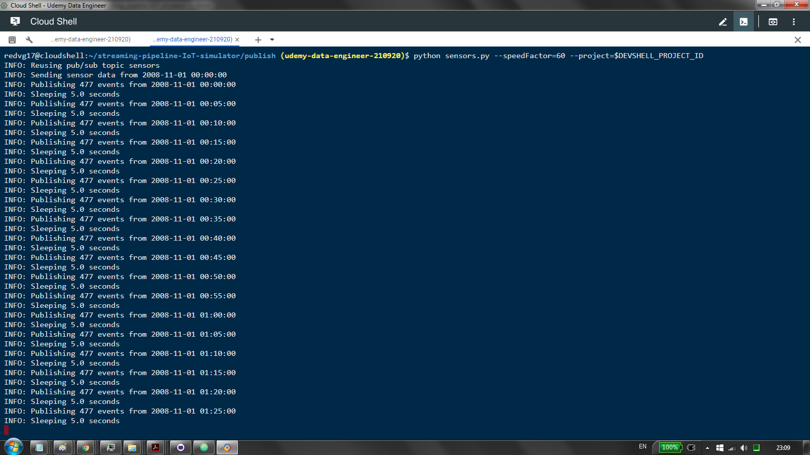
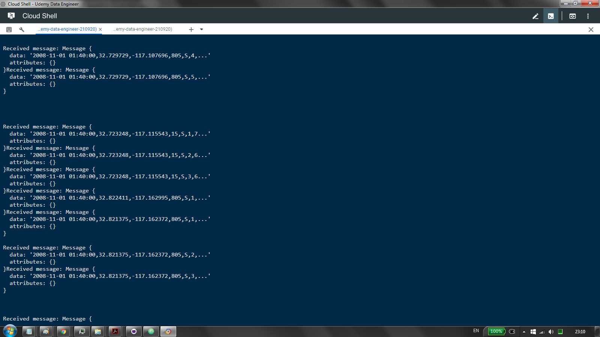
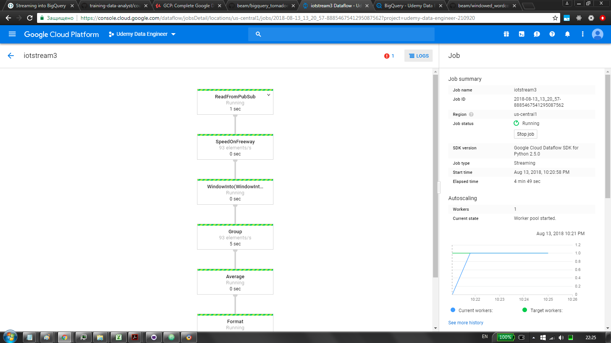
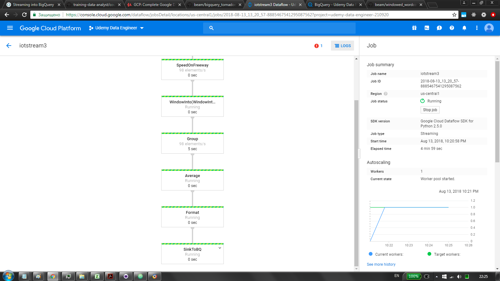
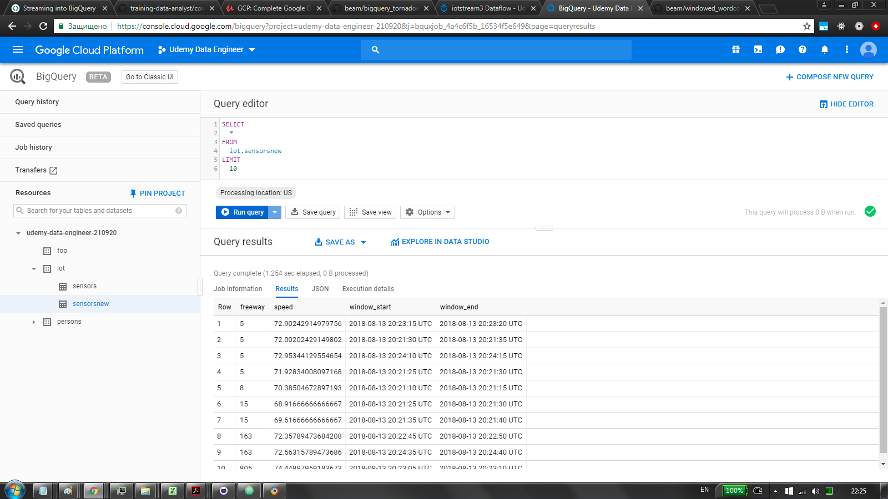
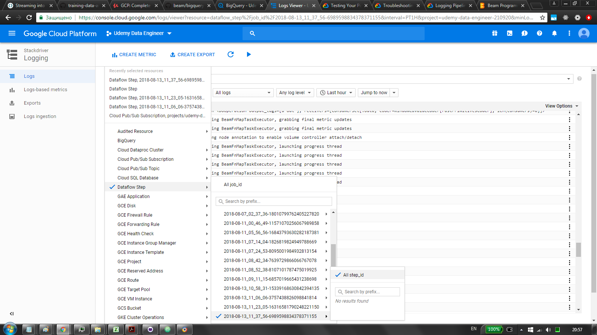
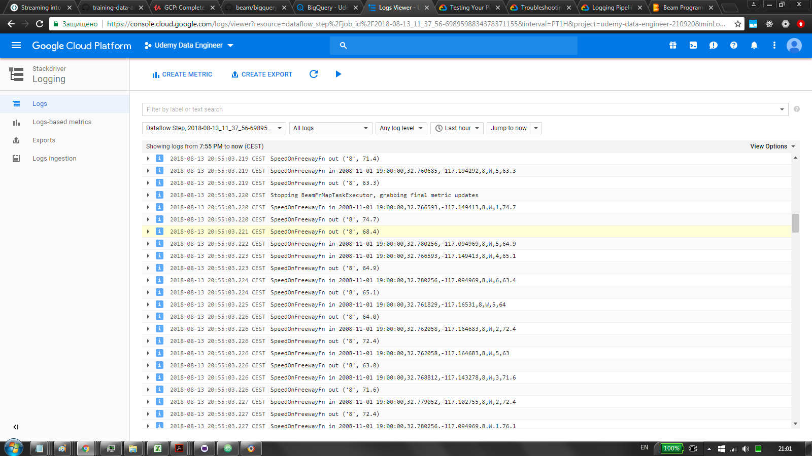
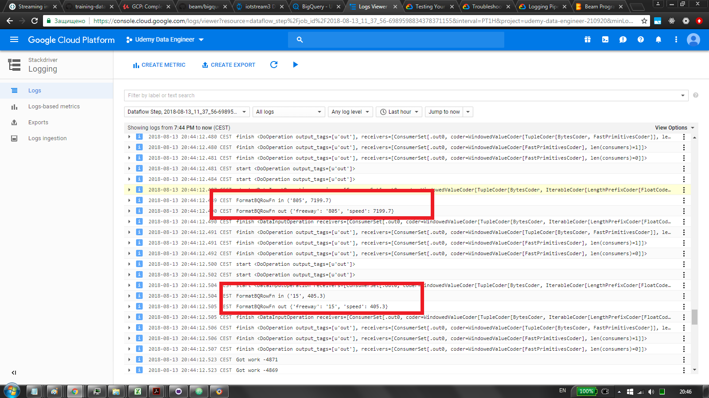
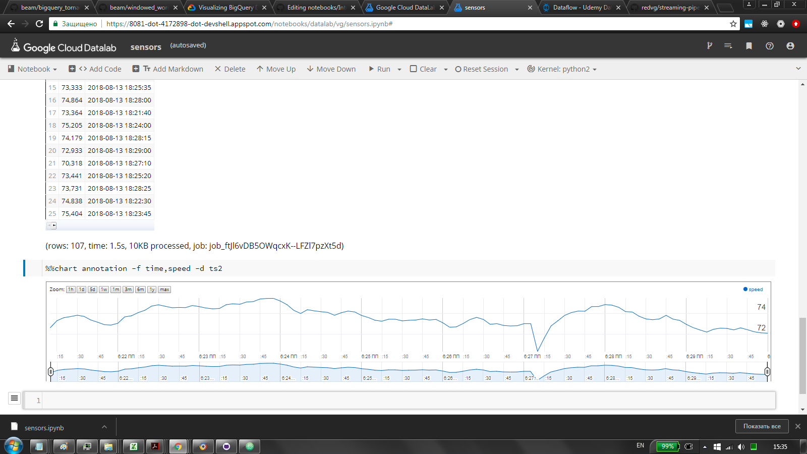

ETL Pipeline on GCP. PubSub publisher which simulates IoT sensors streaming data. PubSub subscriber as an ingress. DataFlow as data transform. BigQuery as a sink.

(created with https://online.visual-paradigm.com)

as per https://github.com/GoogleCloudPlatform/training-data-analyst/tree/master/courses/streaming \
and per https://www.udemy.com/gcp-data-engineer-and-cloud-architect/learn/v4/t/lecture/7598768?start=0 \
and per https://www.udemy.com/gcp-data-engineer-and-cloud-architect/learn/v4/t/lecture/7598772?start=0 \
and per https://www.udemy.com/gcp-data-engineer-and-cloud-architect/learn/v4/t/lecture/7598774?start=0 \

## publish
`./init.sh` \
`./run.sh` \
chmod u+x ... \
holds sensors simulator publisher \
data is from sensors along San Diego highway \
sensors publish speeds of cars in a particular lane \
`speedFactor` 60 sends roughly 477 events every 5 seconds \
nb: deeper dive at  https://github.com/GoogleCloudPlatform/python-docs-samples/blob/master/pubsub/cloud-client/subscriber.py \
https://github.com/GoogleCloudPlatform/python-docs-samples/blob/master/pubsub/cloud-client/publisher.py \
\
sensors' data format: \
TIMESTAMP,LATITUDE,LONGITUDE,FREEWAY_ID,FREEWAY_DIR,LANE,SPEED \
2008-11-01 00:00:00,32.749679,-117.155519,163,S,1,71.2

### sensors.py
`publish()` publishes messages \
see commit a8b30485f6ec4f834efd30a1b69155daf530d74d for obsolete batch msging \
note `TOPIC` const \
`simulate()` simulates sensors data \
-`compute_sleep_secs()` determines how long to wait based on  `speedFactor` \
-when time passes `publish()` is called

### init.sh
fetches sensors data

### subscribe.py
an illustration of how the stream could be consumed \
consumes msgs from pull sub \
effectively acts as push sub \
run: `python subscribe.py --project=$DEVSHELL_PROJECT_ID --topic=sensors --name=sensorsSub` \

pub
 
sub
 

## process
`./init.sh iot.sensors` \
`./run.sh $DEVSHELL_PROJECT_ID iot.sensors sensors` \
chmod u+x ... \
consumes PubSub topic stream in DataFlow
calculates average speed on each highway \
sinks to BigQuery

### init.sh
creates BigQuery dataset \
creates BigQuery table \
pips

### run.sh
runs Apache Beam pipeline on Cloud DataFlow backend

### pipeline.py
Apache Beam pipeline built with Python SDK \
streaming connection to PubSub via `ReadFromPubSub` \
performs the following transforms: \
`SpeedOnFreewayFn` extracts freeway id and speed \
`WindowInto` takes 5-minutes' windows \
note: needs to be performed BEFORE grouping operation like `GroupByKey` otherwise will be in pending indefinetely \
`GroupByKey` groups by freeway \
`resolve_average_speed` gets the average speed on the freeway \
`FormatBQRowFn` adds window start&end and formats into serializable \
`WriteToBigQuery` sinks to BigQuery

dag

bq

## NB

### streaming for python SDK is in beta
monitor progress in gcp py sdk release notes apache beam release notes \
(first 2 links below) \
like the is that dataflow UI is sluggish, kinda useless to monitor \
user the stackdriver logs and metrics and output itself \
also some useful stuff on the streaming can be found below \
https://cloud.google.com/dataflow/release-notes/release-notes-python \
https://beam.apache.org/blog/2018/06/26/beam-2.5.0.html \
https://github.com/apache/beam/blob/master/sdks/python/apache_beam/examples/windowed_wordcount.py \
https://github.com/apache/beam/blob/master/sdks/python/apache_beam/examples/streaming_wordcount.py \
https://beam.apache.org/documentation/sdks/pydoc/2.6.0/apache_beam.io.gcp.bigquery.html \
https://beam.apache.org/documentation/sdks/python-streaming/ \
https://beam.apache.org/get-started/mobile-gaming-example/#leaderboard-streaming-processing-with-real-time-game-data \
https://beam.apache.org/documentation/programming-guide/index.html#core-beam-transforms \
https://cloud.google.com/dataflow/pipelines/specifying-exec-params#streaming-execution \
https://cloud.google.com/blog/products/data-analytics/dataflow-stream-processing-now-supports-python \
https://cloud.google.com/blog/products/data-analytics/review-of-input-streaming-connectors-for-apache-beam-and-apache-spark \
https://github.com/apache/beam/blob/master/sdks/python/apache_beam/examples/cookbook/bigquery_tornadoes.py \

### BigQuery streaming
you might be trapped with `this table has records in the streaming buffer that may not be visible in the preview` \
thats about bq not updating UI \
query will yield though

### ParDos
lambdas removed for logging sake \
uncomment to revert

### verbosity
uncomment to make verbose \
then select stackdriver logging \
\
stackdriver

## explore
contains jupyter notebook for gcp DataLab \
few basics data explorations \
using BigQuery and Charts API

