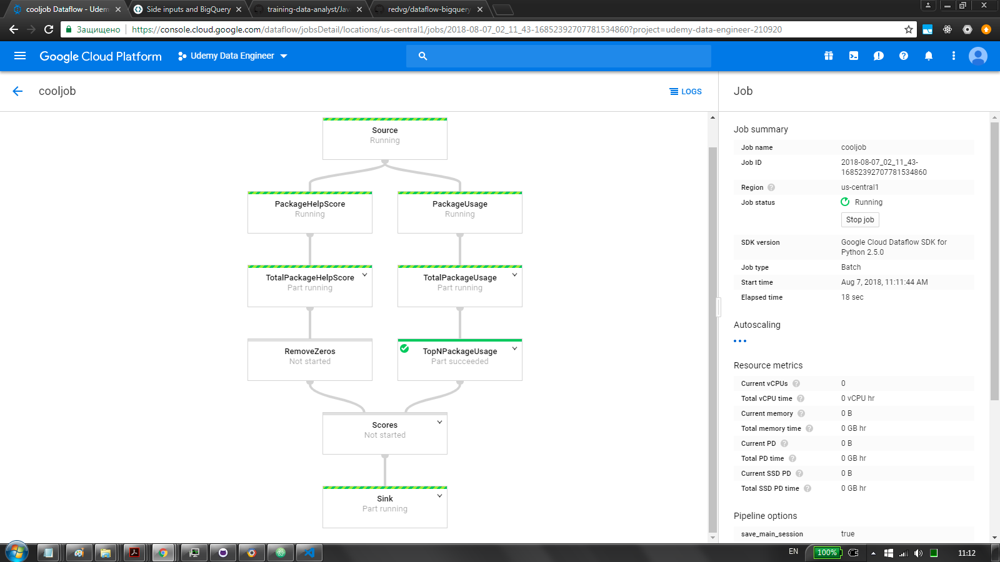
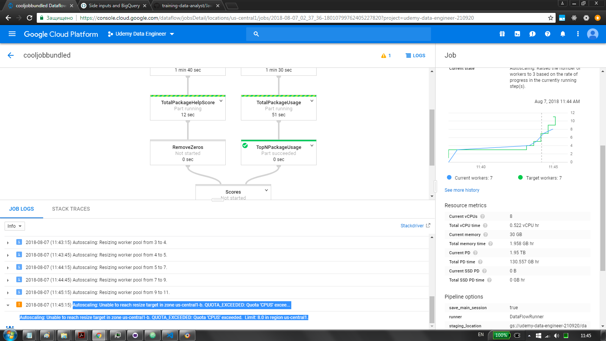

# dataflow_bigquery_source_and_side_input_py
GCP Dataflow pipeline with BigQuery as source and side input in python \
\
as per https://codelabs.developers.google.com/codelabs/cpb101-bigquery-dataflow-sideinputs/ \
and per https://github.com/GoogleCloudPlatform/training-data-analyst/blob/master/courses/data_analysis/lab2/python/JavaProjectsThatNeedHelp.py \
and per https://www.udemy.com/gcp-data-engineer-and-cloud-architect/learn/v4/t/lecture/7598626?start=0 \
\

### helpers.py
`resolve_package_help_score()` assigns +1 if `fixme` or `todo` is found \
`resolve_package_usage()` assigns if pkg is mentioned
`calculate_composite_score()` combines the above \

### pipeline.py
defaults to dataflow deploy, `--local` for direct runner \
pipeline logic resides in `create_pipeline()` \
initial source from bigquery query \
input then passed to `create_popularity_view()` and `create_help_view()` which yield 2 separate views \
beam transformations are then applied to those pcollections separately \
`create_popularity_view()` resolves popularity with `resolve_package_usage()` \
`create_help_view()` resolves help score with `resolve_package_help_score()` \
hence DAG is splitted by calculating help score & usage separately \
DAG is then merged by calculating composite score from the above views \
sinks to cloud storage \

## DAG

## Note on scaling
autoscaling will try to increase workers to 11, if you have default quota it will fail, though will proceed with what it has \
Autoscaling: Unable to reach resize target in zone us-central1-b. QUOTA_EXCEEDED: Quota 'CPUS' exceeded.  Limit: 8.0 in region us-central1. 

