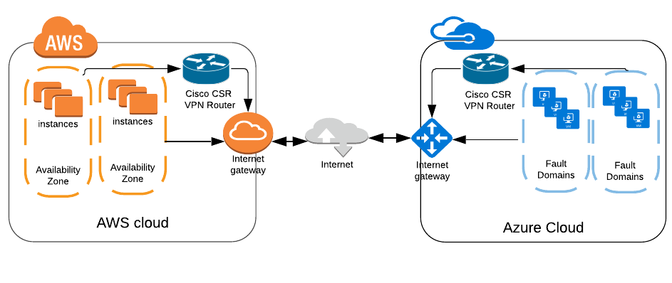

# Multi-Cloud Open DC/OS on AWS with Terraform
# AWS and Azure

Requirements
------------

-	[Terraform](https://www.terraform.io/downloads.html) 0.11.x

## Deploying Multi-Cloud DCOS 

This repository is meant to get the bare minimum of running a multi-cloud DC/OS cluster.

This repo is configured to deploy on AWS and Azure using Cisco CSR 1000V for VPN connection in between.

### High Level Overview of Architecture

* Creates an AWS cluster with masters and agents
* Creates an Azure node with public and private agents
* Main DC/OS cluster lives on AWS
* Bursting Node lives in Azure

## Lab Documentation

1. [LAB1 - Deploying AWS Using Terraform](./labs/lab-1-deploying-hybrid-cluster.md)
2. [LAB2 - Bursting from AWS to Azure](./labs/lab-2-bursting-from-aws-to-azure.md)
3. [LAB3 - Deploying and Migrating Stateless App from AWS to Azure](./labs/lab-3-deploying-and-migrating-stateless-app.md)
4. [LAB4 - Deploying Cassandra Multi DataCenter](./labs/lab-4-deploying-cassandra-multi-dc-cluster.md)

Note: No major enhancements should be expected with this repo. It is meant for demo and testing purposes only.
