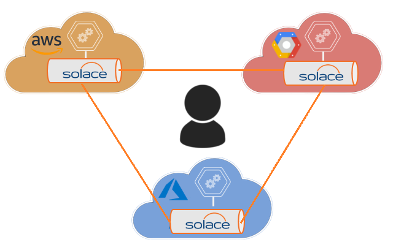

# solace-multi-cloud-chat

This is a very simple application that demonstrates multi-cloud chat using Solace.




## Pre-Requisites
Startup a VMR in 

   * [GCP](https://github.com/SolaceLabs/solace-gcp-quickstart)
   * [AWS](https://aws.amazon.com/quickstart/architecture/solace-vmr/)
   * [AZURE](https://github.com/SolaceProducts/solace-azure-quickstart-template)

   Connect the three VMRs together using [Multi-Node Routing](https://docs.solace.com/Features/Multi-Node-Routing.htm) 

Provision a solace-chat vpn on all the three nodes, enable websockets and a create username/pass as well.

Modify the credentials/ip-addresses in the MultiCloudChat.js in the following objects:
```
var vpnSettings = {
    "vpnName":"solace-chat",
    "userName":"solace-chat-user",
    "password":"solacechatter"
};

var cloudPropertiesMap = {
    "aws": {
        "host":"ws://x.x.x.x:port",
        "up": true,
        "connected":false
    },
    "gcp": {
        "host":"ws://x.x.x.x:port",
      "up":true,
      "connected":false  
    },
    "azure": {
        "host":"ws://x.x.x.x:port",
        "up":true,
        "connected":false
    }
};


```

Download the solace javascript client libraries from [solace.com](https://products.solace.com/download/JS_API) and place it under the lib folder

You should now will be able to chat across the clouds!

