# Build Out VSTS CI Pipeline

In this portion of the lab we will be creating the Continuous Integration (CI) pipeline in VSTS.

A CI Pipeline allows us to define a Build Stage, which will allow us to automate the required steps to package our application code into their preferred runtime environments.  

In this lab we will be pushing in new code to our Git Repository, which will then trigger the packaging of three (3) Applications - a Web frontend, an REST API backend and a Database Server - into three (3) separate Docker Container Images.

Upon a successful build for each application, we will push the newly created Docker Image to an Azure Container Registry which will allow us to leverage these Images from a central location into multiple target environments (e.g. Dev, Test, Production).

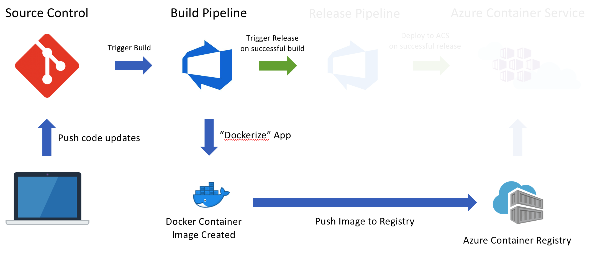

## Exercise 1 - Create New Project in VSTS

In this section we will be creating a new Git-based Project in VSTS. This will be used as source control for our project as well as building out the CI and CD Pipelines.

1. **Navigate to your VSTS Account**

* It will look similar to the following depending on what you setup in Lab 1: http://<VSTS_ACCOUNT_NAME>.visualstudio.com

2. **Create a New Project**

* Click on the **New Project** button.
* Enter **akspipeline** for the Project name.
* Make sure **Version control** is set to **Git**, should be the default.
* Make sure **Work item process** is set to **Agile**, again, should be the default.
* Click **Create** button.
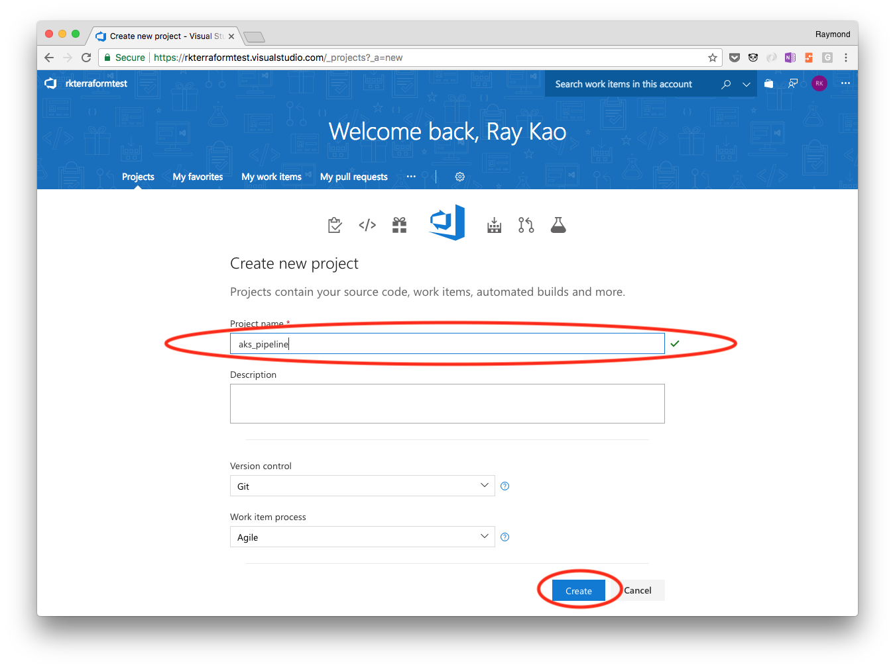

3. **Note Git Endpoint**

* Once the Project has been created you will see a getting started page.
* Note the Git Url, it should look like: ```http://<VSTS_ACCOUNT_NAME>.visualstudio.com/_git/akspipeline```

## Exercise 2 - Add App Code to VSTS Project

Please note it is possible to setup VSTS to leverage other source control repositories, that is not the main focus of this exercise. For the purposes of this lab we will be pushing existing code into VSTS to keep things simple.

1. **Note Getting Started Options**

* As you can see there are a variety of ways to get started. You can clone to your computer, push existing, import, initialize or build code from external repository.
* As noted above, we are going to push an existing repository. Click on the **or push an existing repository from command line** link to see the steps.

2. **Create New Local Repo**

* We will be using the Justice League App folder from the following repository: http://github.com/azure/blackbelt-aks-hackfest
* If you do not already have the repository cloned, please clone it to your local computer.
    ````:bash
    cd ~/Documents
    git clone git@github.com:Azure/blackbelt-aks-hackfest.git
    ````
* Create a new Repo directory on your computer called **justiceleagueapp**.
    ```:bash
    cd ~/Documents
    mkdir justiceleagueapp
    cd justiceleagueapp
    ```
* Copy the **app** and **helper-files** folders from the Repo above into the newly created **justiceleagueapp** folder.
    ```:bash
    cd ~/Documents/justiceleagueapp
    cp ~/Documents/blackbelt-aks-hackfest/linux-container/app .
    cp ~/Documents/blackbelt-aks-hackfest/linux-container/helper-files .
    ```
* Open that newly created directory using VS Code.
    * Change directory into the new **justiceleagueapp** folder (or whatever you named that directory) 
    ```:bash 
    # presuming you are in the directory ~/Documents/justiceleagueapp

    code .
    # (=> code "dot"/"period") to launch current app directory in VSCode to start editing files 
    ``` 
* Add a **.gitignore** file to the Repo. Copy and paste the contents from [here](../helper-files/.gitignore).
* We will be adding one new file to the Repo. It is a **databaseload.sh** script file to help us load the Mongo DB database as part of our Release pipeline. Copy and paste the content of the **databaseload.sh** file from [here](../helper-files/databaseload.sh) into a new file called **databaseload.sh** in the helper-files directory.
* Using the **Source Control** navigation option in VS Code on the left-hand side, Initialize the local Repo.
* 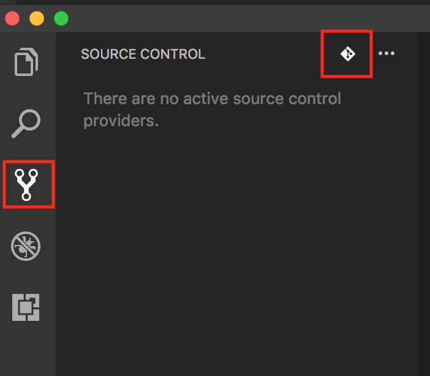
* Once initialized, add all the files to the Repo by entering a Comment such as **Initial commit.** and then click on the **checkmark** at the top of the window.
* You now have a local Git Repo, next step is to push it up to VSTS.
* 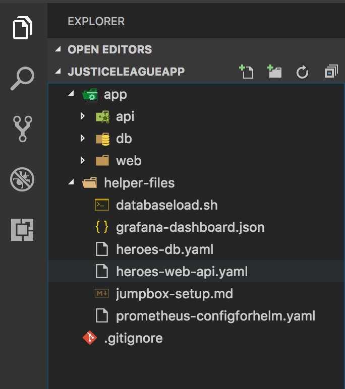


3. **Push Local Repo to VSTS**

* Now that you have a local Git Repo, we need to add VSTS as a Remote origin. To do this we will open the VS Code Terminal Window. This is done by hitting **Ctrl + ~** on teh keyboard.
* Once at the command prompt, you are going to use the **or push an existing repository from command line** commands from Exercise 1 above.

```bash
git remote add origin https://<VSTS_ACCOUNT_NAME>.visualstudio.com/_git/akspipeline
git push -u origin --all
```

* At this point you should have all of your code in VSTS Source Control. Click on the **Code** navigation item near the top of the VSTS window to see your checked in code.
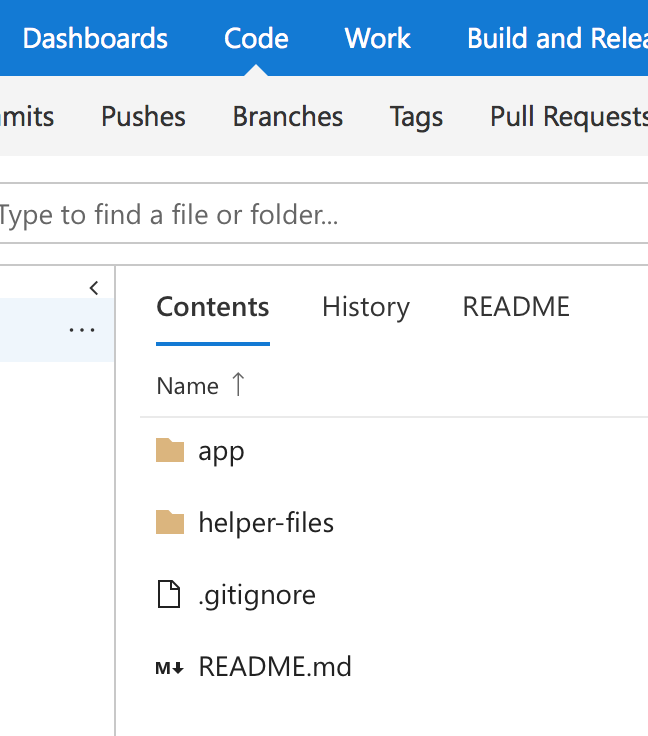

## Exercise 3 - Create Build Pipeline

1. **Create Empty Build Pipeline**

* Hover over the **Build and Release** navigation item near the top of the VSTS window. You will see a list of drop-down options, click on **Builds**.
* Click on **+ New definition** to create a new Build.
* All the defaults should be correct.
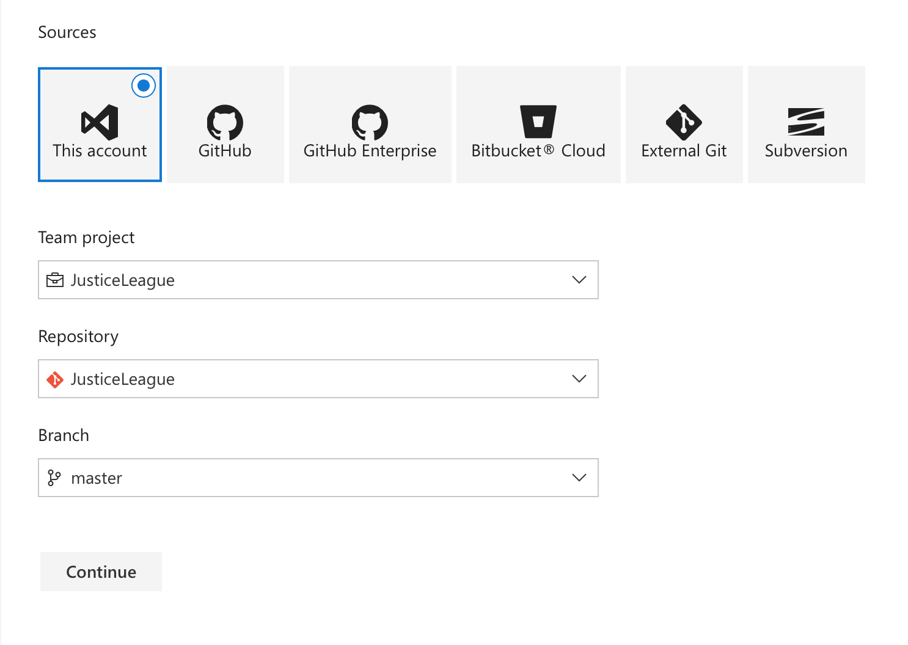
* Once verifying the defaults, click **Continue**.
* Select **Empty Process**.
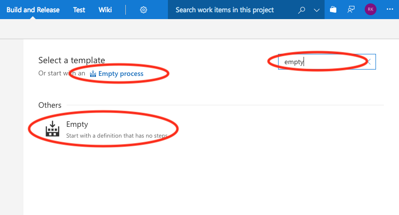

2. **Set Correct Agent Queue**

* Note the default pipeline name, **akspipeline-CI**, you can choose to keep the default or name it somethign new.
* Under the **Agent queue**, be sure the **Hosted Linux Preview** option is selected from the drop-down menu. This represents the type of build machine that is being used.
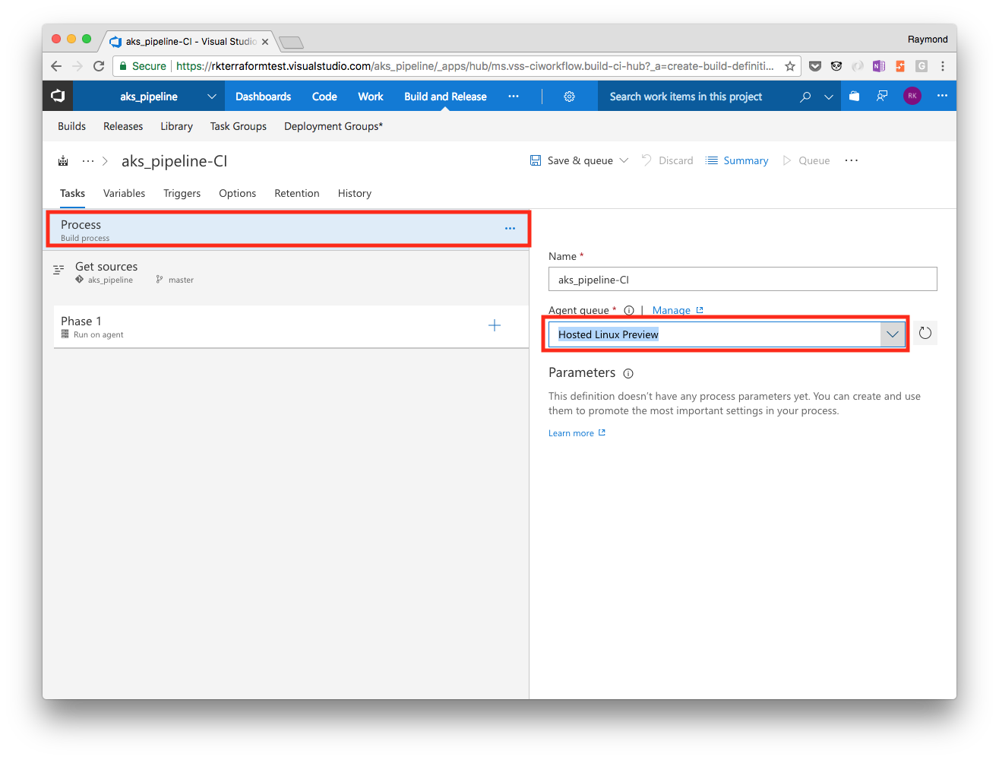

3. **Validate Sources and add two (2) Docker Tasks**

* If you click on **Get sources** on the left you will notice that it is pointing to your VSTS Project Repo. If not, you have done something wrong, please re-visit previous steps.
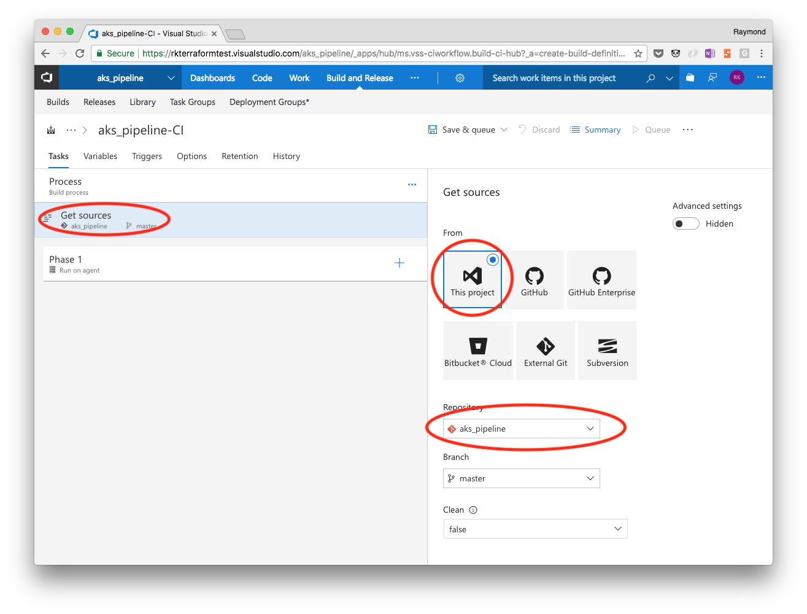
* Next, click on the **Phase 1** link on the left-hand side. You will notice that this Build Agent Phase automatically inherits the type of Build Agent from the Parent Build Process.
* You can change the **Display name** or leave it as is, up to you.
* The next step is to add Docker Build and Docker Push steps to the pipeline. This is done by clicking on the **+** next to **Phase 1**, entering **docker** in the search box, hover over the **Docker** taks, then hit the **Add** button twice.
  * This will add two "Docker Tasks" to your "Phase 1" Agent Phase
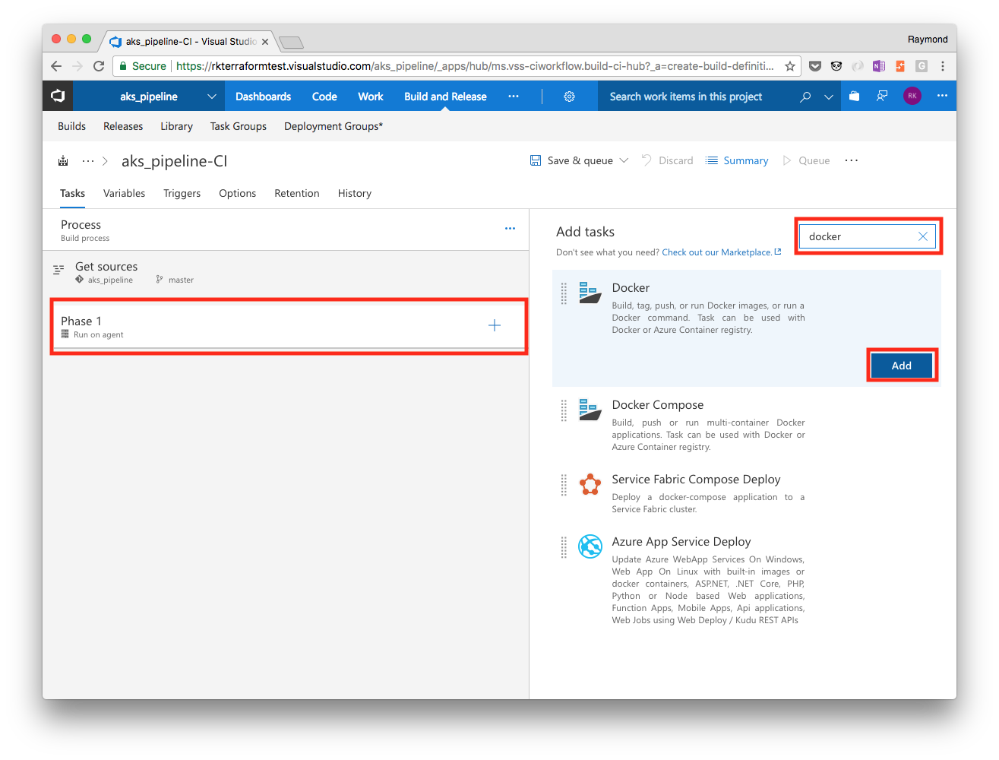

4. **Configure Docker Build and Push DB Tasks**

In this step we will be configuring the automated build of the Container Image for the database portion of the application.

* Link Existing Azure Service Principal to VSTS so drop-down boxes will be automatically filled in.
    * Click on the first of the two (2) Docker Tasks, go to the Azure Subscription and click on the **Manage** link.
    * 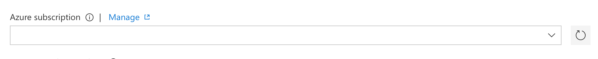
    * Next, create a new Azure Resource Manager (ARM) **Service Endpoint**.
    * 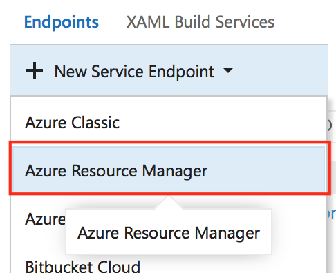
    * Next, click on the full version option at the bottom of the screen.
    * 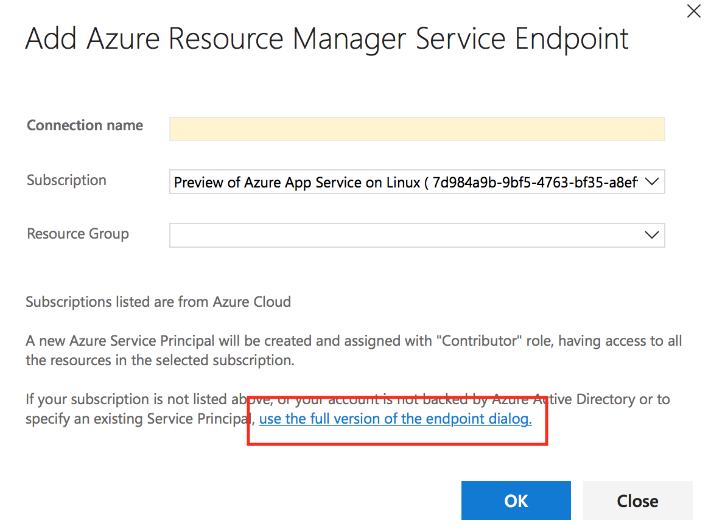
    * Lastly, fill in the blanks using the Service Principal credential information provided as part of the lab creation.
    * 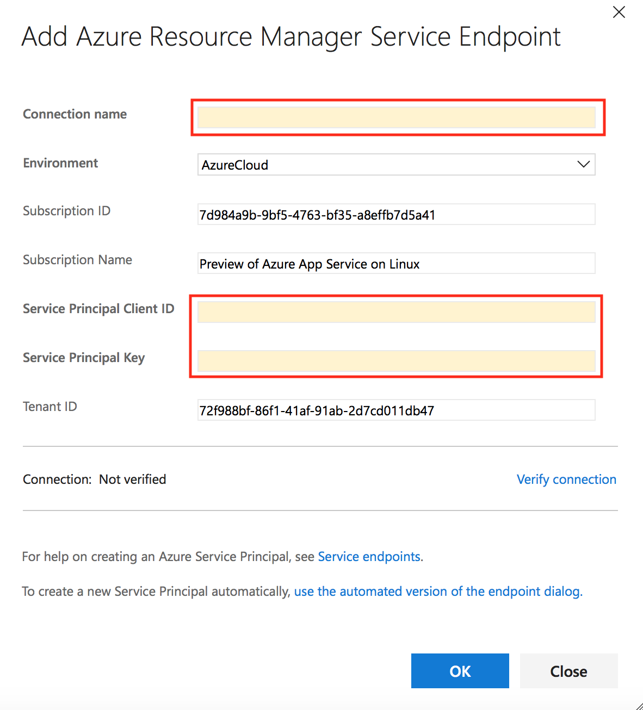

* Click on the first of the two (2) Docker Tasks, and modify the following fields and values:
    * ***Display name:*** ```Build API Image```
    * ***Container Registry Type:*** ```Azure Container Registry```
    * ***Azure Subscription:*** ```Choose Azure Subscription```
    * ***Azure Container Registry:*** ```Select from drop-down```
    * ***Action:*** ```Build an image```
    * ***Docker File:*** ```Choose file using the ... select menu on the right```
    * ***Build Arguments:*** ```(LEAVE BLANK)```
    * ***Use Default Build Context:*** ```Ensure it is Checked```
    * ***Image Name:*** ```<ACR_NAME>.azurecr.io/azureworkshop/rating-api:$(Build.BuildId)```
    * ***Qualify Image Name:*** ```Ensure it is Checked```
    * ***Additional Image Tags:*** ```(LEAVE BLANK)```
    * Leave the rest as the defaults.
* Click on the second of the two (2) Docker Tasks, and modify the following fields and values:
    * ***Display name:*** ```Push API Image```
    * ***Container Registry Type:*** ```Azure Container Registry```
    * ***Azure Subscription:*** ```Choose Azure Subscription```
    * ***Azure Container Registry:*** ```Select from drop-down```
    * ***Action:*** ```Push an image```
    * ***Image Name:*** ```<ACR_NAME>.azurecr.io/azureworkshop/rating-api:$(Build.BuildId)```
    * ***Qualify Image Name:*** ```Ensure it is Checked```
    * ***Additional Image Tags:*** ```(LEAVE BLANK)```
    * Leave the rest as the defaults.
* After completing the above, click on the **Save & queue** button near the top right. A window will pop-up, leave the defaults and hit the **save & queue** button to start the build.

5. **Validate Successful Build**

* After clicking on the save & queue button above, you will see a message near the top of the page that a new build has been kicked off with a number. Clicking on that number will take you to the build run and show you the progress.
* A successful run is **green**. If there is **red** it means the build failed. Use the build run output to troubleshoot errors, fix the errors, and then run another build.

6. **Repeat Steps 3 and 4 Above for Web and API Containers**

* ***Hint:*** You will need to add 4 more Docker Tasks, 2 each for API and Web.
* ***Hint:*** Remember to select the correct **Docker File** associated to each part of the app.
* ***Hint:*** Don't forget to ensure you change the **Image Name** associated to each part of the app.

7. **Add Artifacts to Build Output**

* The next step is to add Publish Output steps to the pipeline. This is done by clicking on the **+** next to **Phase 1**, entering **publish** in the search box, hover over the **Publish Build Artifacts** task, then hit the **Add** button.
* Click on the **Publish Artifact** task and update the following:
    * ***Display name:*** Publish Yaml
    * ***Path to Publish:***   Use the ```...``` (elipsis) on the right-hand side to select the **helper-files** folder
    * ***Artifact Name:***   yaml
    * ***Artifact publish location:***   Visual Studio Team Services/TFS
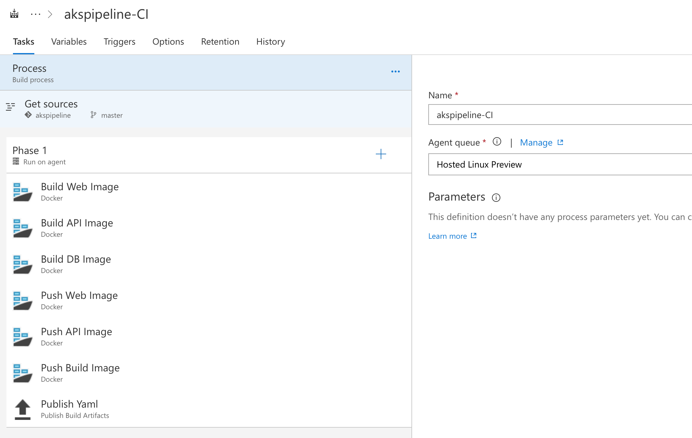
* After completing the above, click on the **Save & queue** button near the top right. A window will pop-up, leave the defaults and hit the **save & queue** button to start the build.

8. **Enable Continuous Integration**

* To enable Continuous Integration, meaning that everytime your code is checked in a build will run, click on **Triggers** just above the Process bar.
* Click the **Enable continuous integration** checkbox.
* Click the **Save & queue** button in the top right and select **Save** from the drop-down to save your changes.
* You are done, now wasn't that easy.
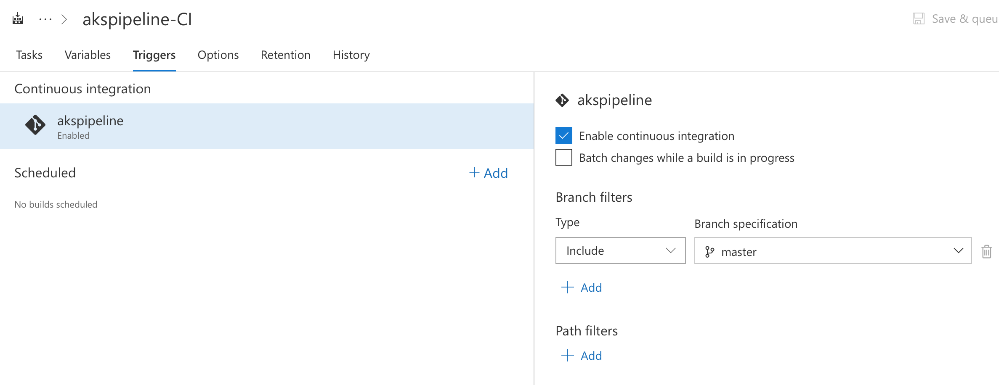

## Summary

At this point you should have a fully functioning CI process that builds all 3 Container Images (Web, API, DB) as well as pushing all 3 Container Images (Web, API, DB) to Azure Container Registry. Now you are ready to build the Release Pipeline and release the build to AKS.
