# Build Out VSTS CD Pipeline

In this portion of the lab we will be creating the Continuous Deployment (CD) pipeline in VSTS.

A CD pipeline allows us to define Release stages, which will deploy our app(s) to specific environments.  In this lab, we will be deploying only to a single Developement ("Dev") environment.  You can create multiple release stages, with each one targeting different enviroments (e.g. Development, Test, Produciton etc.).  

A Release can consist of multiple phases, and each phase itself can/will have multiple tasks to run and execute.  We will be creating a Release with only a single phase, but with four (4) tasks to complete to deploy our applications from our previous [CI Build Pipeline](02-build_vsts_ci.md).

At the end of this lab, we will automate the execution of our Continuous Deployment (CD) Release Pipeline, when a successful Continuous Integration (CI) Build Pipeline completes.  This will ensure that our environments will automatically deploy new updates as they happen, and only upon successful builds.

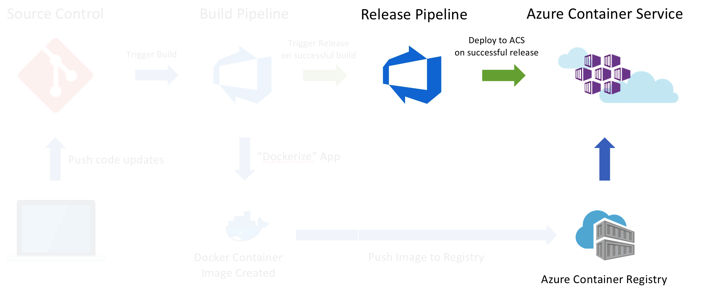

## Exercise 1 - Create Release Pipeline

1. ***Create Empty Release Pipeline***

* Hover over the **Build and Release** navigation item near the top of the VSTS window. You will see a list of drop-down options, click on **Releases**.
* 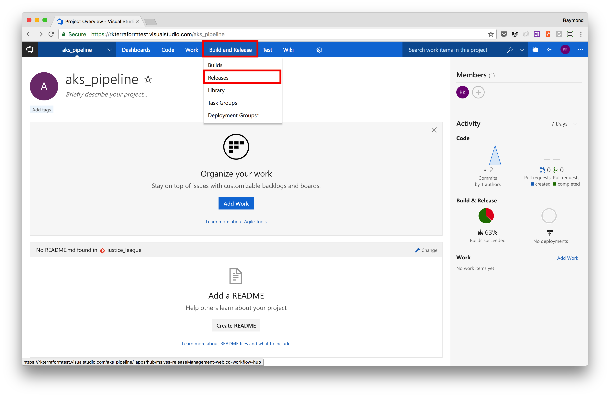
* Click on **New definition** to create a new Release.
* 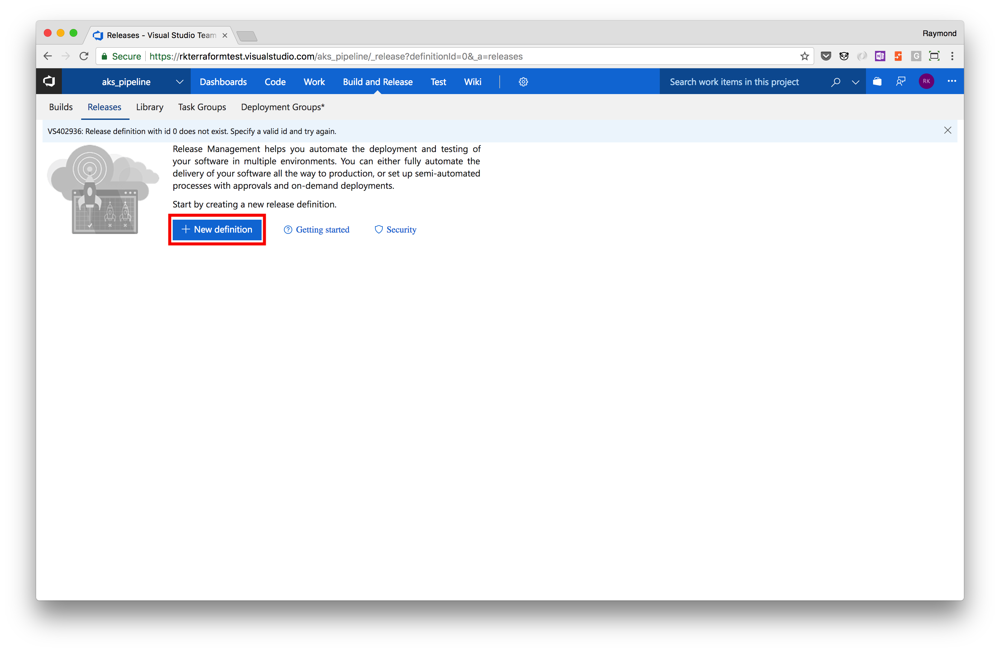
* Enter **Kubernetes** in the search box, hover over the **Deploy to Kubernetes cluster** item and click on **Apply** to add a **Deploy to Kubernetes** task.
* 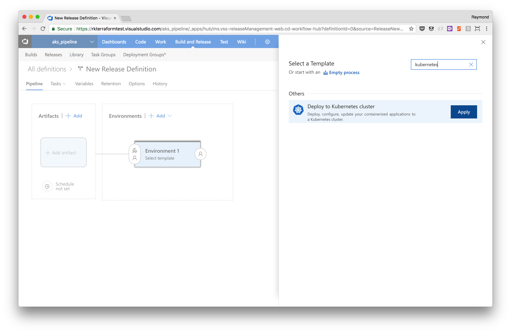
* Name your new release pipline environment "**Dev**"
* 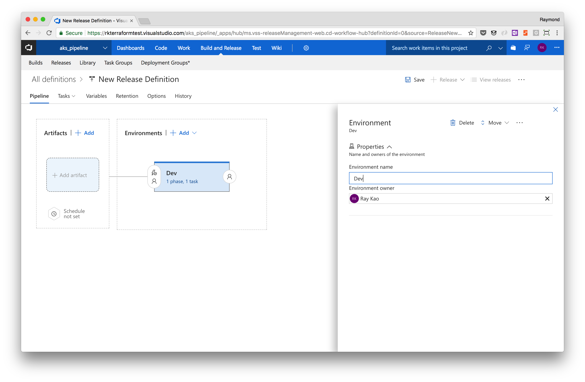
* Rename your release pipeline
* 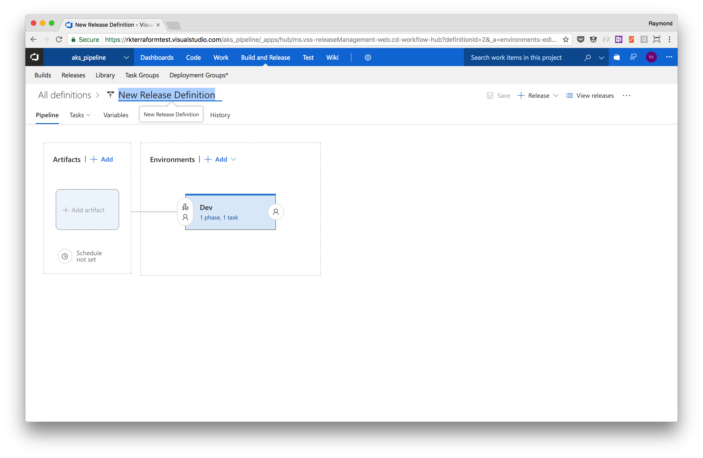
* Let's add more tasks to your release pipeline by clicking the "**1 phase, 1 task**" link
* 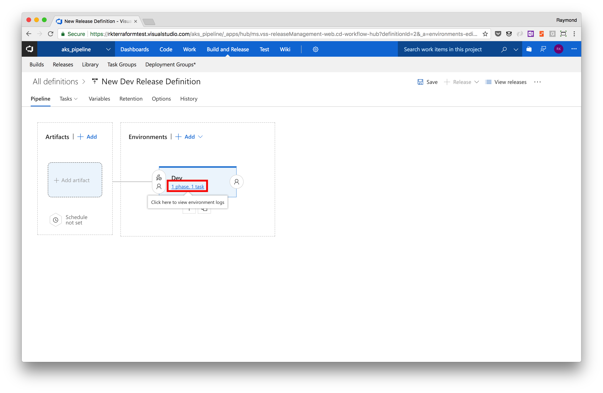
* We will now click on the "**+**" symbol next to Agent Phase to add an additional "**Deploy to Kubernetes**" task
* 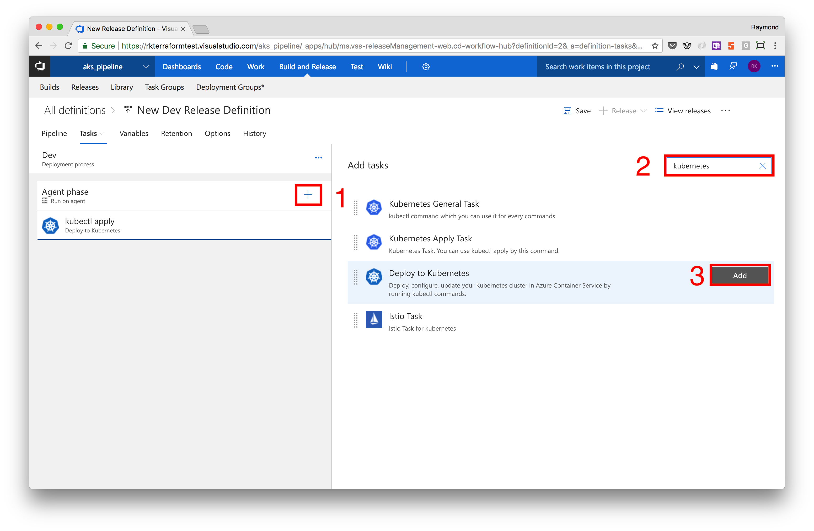
* Next, browse the VSTS Marketplace (we will install an extension from the marketplace)
* 
* Enter **K8s** in the search box, and click on the **Kubernetes Extension** by Tsuyoshi Ushio
* 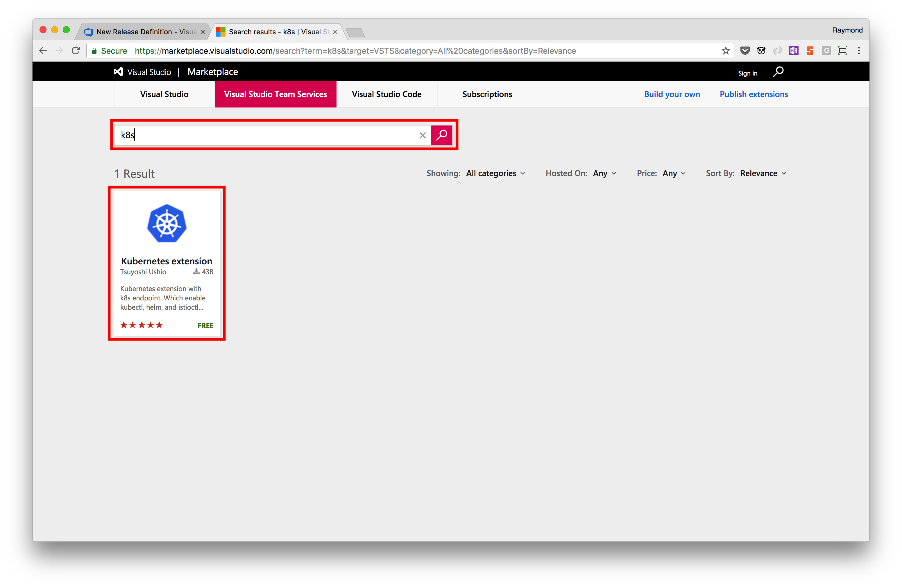
* click on **Get it Free**
* 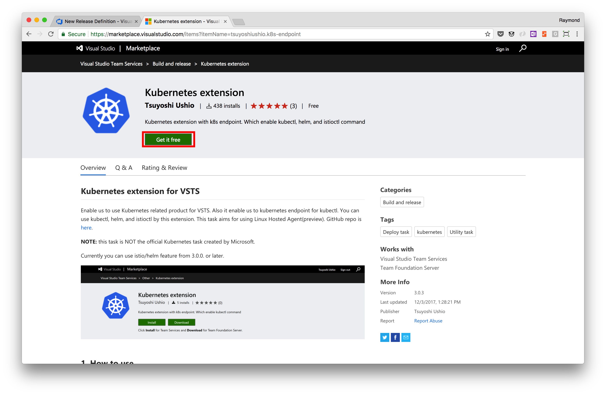
* Install the extension into your VSTS account
* 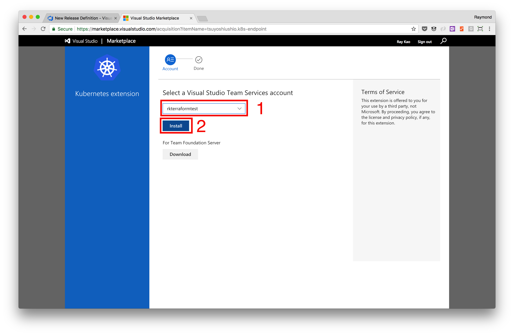
* Hover over the **k8s downloader** item and click on **Add** once to add a kubectl downloader task.
* 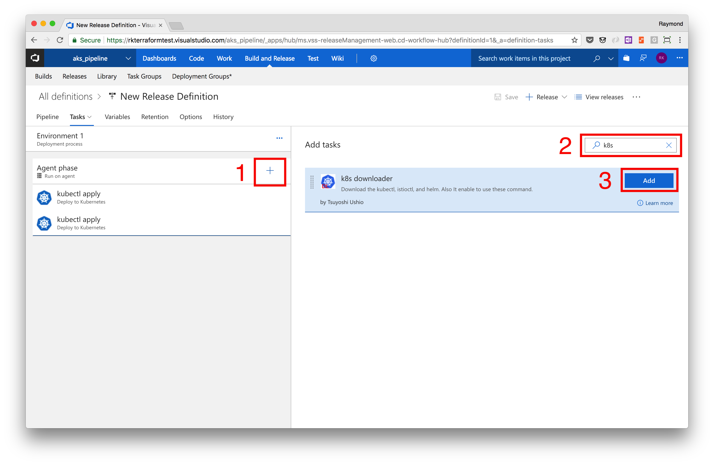
* Enter **bash** in the search box, then find the **Shell Script** item and click on **Add** to add a shell script execution task
* 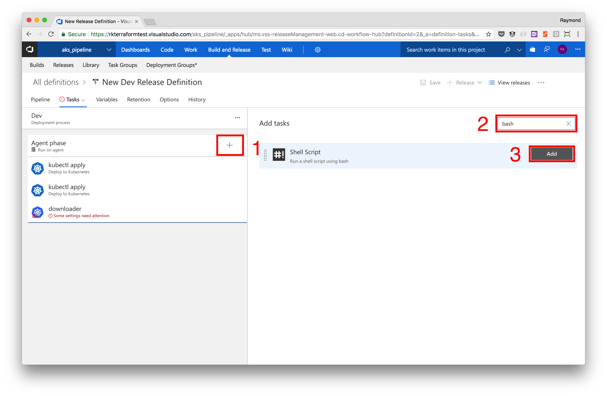
* You should now have 4 tasks under the **Agent phase**.

2. ***Add Dev Environment***

* Change the **Environment name** to **Dev**. Notice the visualization to the left was updated.

3. ***Add Artifact to Release Process***

* Click on the **Add artifact** link in the visualization on the left.
* If you recall from the build setup, the reason for this step is to pull in the yaml artifacts we added to the build publishing output.
* In the **Add artifact** windows that pops-up ensure the following are selected:
    * Project:   akspipeline (Shoudl be the Default)
    * Source (Build Definition):   Select **akspipeline-CI** from the drop-down
    * Default Version:   Latest
* Click on **Add** button to add updates.

4. ***Configure Release Tasks***

* Click on **Agent phase**
* Similar to what we did during the "**Build Phase**" in the [CI process](02-build_vsts_ci.md), we need to change the type of Build Agent
  * Select **Hosted Linux Preview** from the **Agent queue** drop-down
  * Although we will not be changing anything else, take note of the **Parallelism** options under the **Execution Plan** section farther down. If you hover over the information icon you will see more details.

* Next click on the first "**kubectl apply**" task and update the following:
    * **Display name**:   Apply DB Image to K8s Cluster
    * **Kubernetes Service Connection**:   Click on **+ New** to add connection to your cluster.
        * Hint: To get the contents of the kube config file, open it in VS Code and copy and paste the content.
        * Hint: The kube config file is located in your home directoy in a hidden folder called **/.kube/config**
    * **Command**:   apply
    * **Use Configuration files**:   Ensure this is Checked
    * **Configuration File**:   Use the elipsis (```...```) to select the **heroes-db.yaml** file in the yaml output folder
    * **Expand Container Registry Details**:   Point to your Azure Container Registry and use **vstssecret** as the **Secret name**. Ensure the **Force update secret** Checkbox is enabled.
    * Click on **Save**, then **Ok**.

* Next Click on the second "**kubectl apply**" task and update the following:
    * **Display name**:   Update K8s DB Image
    * **Kubernetes Service Connection**:   Select existing **AKS** endpoint.
    * **Command**:   apply
    * **Use Configuration files**:   Ensure this is NOT Checked
    * **Arguments**:   image deployment/heroes-db-deploy heroes-db-cntnr=<ACR_NAME>.azurecr.io/azureworkshop/rating-db:$(Build.BuildId)
    * **Expand Container Registry Details**:   Point to your Azure Container Registry and use **vstssecret** as the **Secret name**. Ensure the **Force update secret** Checkbox is enabled.

* Click on the third "**downloader**" task and update the following:
    * **Display name**:   kubectl downloader
    * **Kubernetes Service Connection**:   Select existing **AKS** endpoint.
    * Don't change anything else.

* Click on the fourth **Bash** task and update the following:
    * ***Display name***:   Load DB
    * ***Script Path***:   Use the elipsis (```...```) and select **databaseload.sh** file from the build output.
    * ***Arguments***:   (Leave Blank)

* Click on **Pipeline** in the navigation under **All definitions**.

5. ***Kick off New Release***

* Click on the **+ Release** link in the upper right-hand corner and select **Create release**.
* Click the **Create** button to kick off the release process.
* You will see a new Release  with a number link near the upper left-hand corner, click on that release number.
* A new browsing tab will have opened and you can look at the progress of the release. If it is green then all is good. If it is **red** then click on the **Deployment Status** to see a summary and logs of the errors.
* Troubleshoot the release using the **Logs** navigation itme, fix the errors, kick off a new release.

6. ***Add Web and API Deployments***

* Leverage content in the previous steps 1 and 4 to add tasks for the Web and API parts of the application.
* Hint: You will need 3 more Kubernetes Tasks. The first to apply the web and api containers use the yaml file. The second and third tasks to update the web and api images on the cluster.
    * First Task Name:   Apply Web and API Images to K8s Cluster
    * Second Task Name:   Update K8s API Image
    * Third Task Name:   Update K8s WEB Image

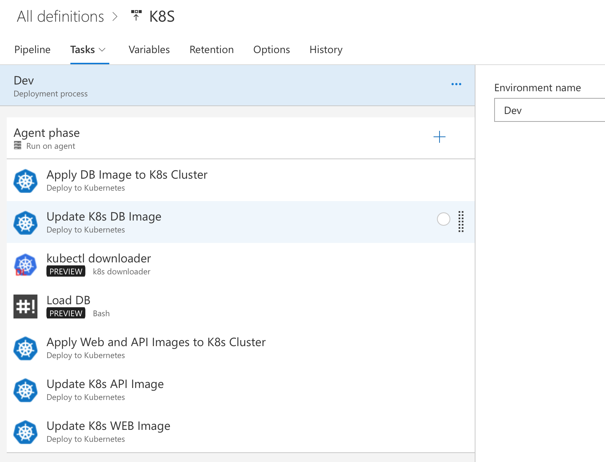

7. ***Kick off Another Release to Test Changes***

* **The only difference in this one versus the one above is that all of the Containers are now being deployed.**
* Click on the **+ Release** link in the upper right-hand corner and select **Create release**.
* Click the **Create** button to kick off the release process.
* You will see a new Release  with a number link near the upper left-hand corner, click on that release number.
* A new browsing tab will have opened and you can look at the progress of the release. If it is green then all is good. If it is **red** then click on the **Deployment Status** to see a summary and logs of the errors.
* Troubleshoot the release using the **Logs** navigation itme, fix the errors, kick off a new release.

8. ***Trigger Continuous Deployment***

* Now that we have all of the kinks worked out in our release, let's have it automatically trigger upon a successful build.
* Hover over the **Build and Release** menu navigation at the top and select **Releases**.
* On the left-hand side select your release definiton, it should be **K8S** if all the directions were followed correctly.
* Once the release is selected, you should see an **Edit** button near the top, click it.
* You should now see the pipeline diagram of your release. In the upper right-hand corner of the **akspipeline-CI** build artifact you will see a lightning bolt, click it.
* In the windows that pops up, enable the trigger. Now you have Continuous Deployment along with Continuous Integration now setup.

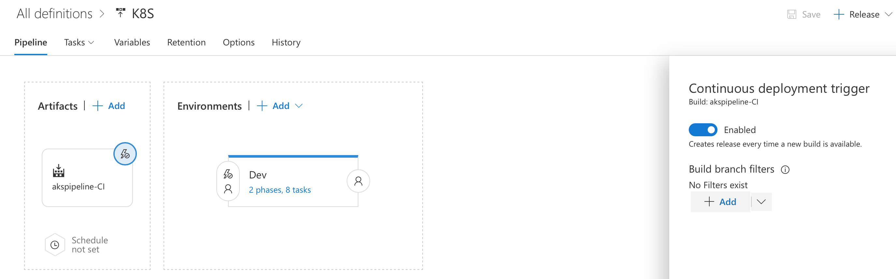

## Summary

At this point you should have a basic but fully functioning CI/CD process that deploys your application to your Kubernetes cluster.  This process is triggered/started upon each code update commited to source control (Git).  This causes an automated Continuous Integration (CI) Build process to start, which will package your code into a new Docker container image(s), save the container image(s) to a Container Registry (e.g. Azure Container Registry) and build a Kubernetes yaml deployment file.  When those have tasks have been built/completed successfully, it will then automatically kick-off a Continuous Deployment (CD) Release process and deploy your updated containerized applications to your target environment/platform (i.e. Azure Container Serivces aka. ACS/AKS).

We have done this to deploy to a basic development environment, but you can modify this to include multiple environments including a production scenario with minimal changes.  Please note that a proper CI/CD process should include testing, which we have not included in this lab.